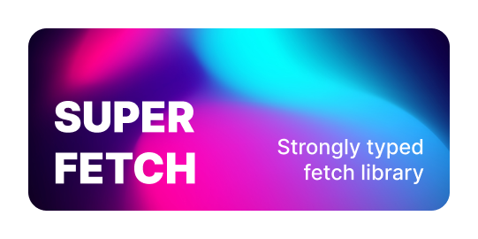

# Super Fetch
Библиотека Super Fetch — это легковесная библиотека ESM (распакованных 48.8 kB), которая обеспечивает строгий и безопасный
интерфейс для выполнения HTTP-запросов с использованием
[Fetch API](https://developer.mozilla.org/en-US/docs/Web/API/Fetch_API).

### Возможности

- **API**: запросы, построенные на основе API-репозитория, позволяющие указать типы для query-параметров,
  параметров пути как в express, тел успешного и неуспешного ответов, а также тело запроса.
- **Simple**: упрощённый способ запросов с помощью `.get`, `.post` и других методов REST API.
- **Linked sequence**: Среда созависимых запросов, в которой старые ответы не могут перезаписать новые.
- **Long polling**: Управляемый лонгполлинг.

### Установка
Вы можете установить библиотеку, используя NPM:
```shell
npm i @samsonium/super-fetch
```

### Поддержка проекта
Если вы знаете о какой-либо проблеме или у Вас есть предложение для улучшения проекта, опишите её в разделе
[issue](https://github.com/samsonium/super-fetch/issues) или отправьте запрос на слияние.

### Лицензия
Данный проект управляется лицензией MIT.
